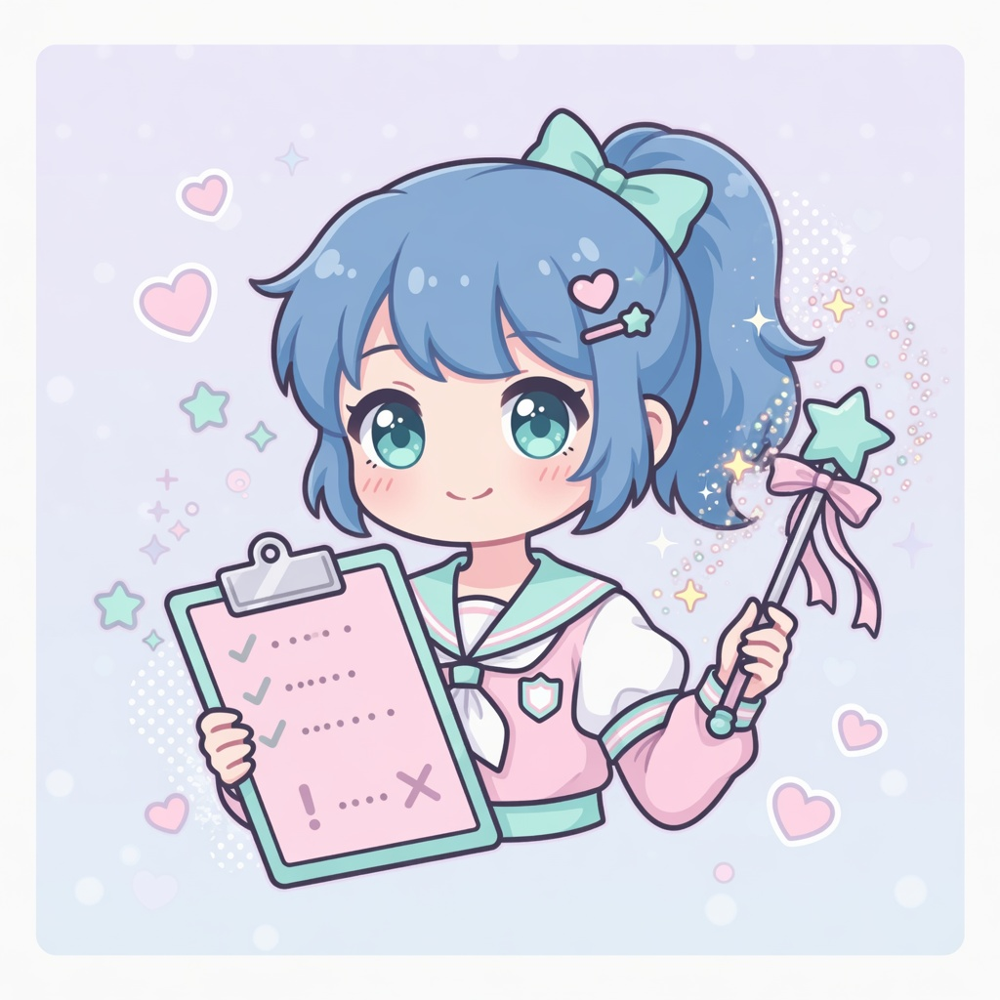

<p align="center">
  
</p>

<h1 align="center">♡ REM ALL IN ONE BOT ♡</h1>

<p align="center">
  <b>your soft, sparkly Discord bestie~</b><br>
  one bot · every tool · zero chaos ✧
</p>

<p align="center">
  
  
  
  
  
</p>

<p align="center">
  <sub>119 cogs · pastel panels · built with love by <b>devrock</b> · (ﾉ◕ヮ◕)ﾉ*:･ﾟ✧</sub>
</p>

<br>

<p align="center">
  <a href="#-what-is-rem">What is REM?</a> ·
  <a href="#-start-in-3-steps">Start</a> ·
  <a href="#-super-powers">Powers</a> ·
  <a href="#-music-corner">Music</a> ·
  <a href="#-setup">Setup</a> ·
  <a href="#-env-keys">Env</a> ·
  <a href="#-folder-tour">Folders</a>
</p>

<br>

## ♡ What is REM?

**REM** is a cute but powerful all-in-one Discord bot for servers that want everything in one place.

Instead of juggling five different bots, you get moderation, security, music, tickets, welcome flows, games, logging, and utility commands — all wrapped in soft pastel **Components V2** panels that actually look good.

> ✿ think: helpful mod tools + cozy UI + a lot of commands, without the mess~

<br>

## ♡ Start in 3 Steps

```bash
pip install -r requirements.txt
copy .env.example .env
python rem.py
```

| Step | Do this | Why |
|:---:|:---|:---|
| 1 | `pip install -r requirements.txt` | grab dependencies |
| 2 | copy `.env.example` → `.env` | add your bot token |
| 3 | `python rem.py` | boot REM |

**Minimum `.env` keys:**

```env
TOKEN=your_discord_bot_token
OWNER_IDS=your_user_id
PREFIX=>
```

> ✿ that's literally it to get online~ music & AI are optional extras.

<br>

## ✧ Super Powers

<p align="center">
  
  &nbsp;
  
  &nbsp;
  
  &nbsp;
  
</p>

<table>
<tr>
<td width="50%" valign="top">

### 🛡️ Security
- **Antinuke** — stops nukes before they spread
- **Automod** — spam, caps, links, invites
- **Nightmode & emergency** — strip dangerous perms fast
- Whitelist / blacklist / ignore systems

### 🎀 Moderation
- ban · kick · timeout · warn · jail
- lock · hide · purge · snipe
- role tools & topcheck

### 🎵 Music
- Lavalink playback via Wavelink
- cute player · search · queue cards
- loop · shuffle · autoplay · volume

</td>
<td width="50%" valign="top">

### 🏠 Server Life
- tickets · giveaways · logging
- welcome · autorole · vanity roles
- invite tracker · reaction roles

### 🎮 Fun & Games
- chess · wordle · 2048 · rps
- blackjack · slots · typeracer
- button-game UIs

### ✨ Extras
- AI chat *(optional key)*
- translate · QR · maps · stats
- emoji sync · custom roles · AFK

</td>
</tr>
</table>

<br>

## ♡ Music Corner

<p align="center">
  
  
  
</p>

| Command | what it does~ |
|:---|:---|
| `>play <song>` | play now |
| `>search <query>` | pick from results |
| `>nowplaying` | live track info |
| `>queue` | see what's next |
| `>pause` / `>resume` / `>skip` | control playback |
| `>volume <1-150>` | set loudness |
| `>loop` / `>shuffle` / `>autoplay` | queue modes |

**Optional — add to `.env` for music:**

```env
LAVALINK_ENABLED=true
LAVALINK_URI=http://127.0.0.1:2333
LAVALINK_PASSWORD=youshallnotpass
```

> ✿ restart the bot fully after changing music config~

<br>

## ♡ Setup

### You need

| Thing | For |
|:---|:---|
| Python **3.11+** | running the bot |
| Discord **bot token** | login |
| **Message Content** intent | prefix commands |
| **Server Members** intent | mod + welcome + security |
| Lavalink *(optional)* | music only |

### Discord permissions

Give REM **Administrator** for the easiest setup, or manually:

- manage server · roles · channels · messages
- ban · kick · moderate members · audit log
- send messages · embeds · attach files
- connect + speak *(music)*

Security setup commands (`antinuke`, `automod`, `emergency`, etc.) are limited to **owner**, **admin**, or **bypass** users.

<br>

## ♡ Env Keys

| Key | need it? | what for |
|:---|:---:|:---|
| `TOKEN` | ✅ | bot token |
| `OWNER_IDS` | ✅ | your user ID(s) |
| `PREFIX` | — | default `>` |
| `BOT_NAME` | — | name in panels |
| `BYPASS_IDS` | — | trusted bypass users |
| `LAVALINK_URI` | 🎵 | music node |
| `OPENAI_API_KEY` | — | AI chat |
| `COMMAND_LOG_WEBHOOK_URL` | — | command logs |

Full list → [`.env.example`](.env.example)

<br>

## ♡ Folder Tour

```text
rem.py                 ♡ start here
core/                  ♡ bot brain + context
cogs/commands/         ♡ all user commands
cogs/moderation/       ♡ mod actions
cogs/antinuke/         ♡ anti-nuke listeners
cogs/automod/          ♡ automod listeners
cogs/rem/              ♡ kawaii help panels
utils/                 ♡ config · DB · CV2 UI
games/                 ♡ game engines
db/                    ♡ sqlite databases
assets/readme/         ♡ cute readme art ✧
```

<br>

## ♡ Dev Stuff

**syntax check**

```bash
python -m compileall rem.py cogs utils core
```

**health check** *(keep-alive on)*

```text
GET http://127.0.0.1:8080/health
```

**logs**

```text
logs/rem.log
```

<br>

## ♡ Stay Safe

- never commit `.env` or database files
- regenerate token if leaked
- keep `OWNER_IDS` / `BYPASS_IDS` tiny & trusted
- full restart after security or permission changes

<br>

## ♡ Credits

**MIT License** · © 2026 **devrock**

<p align="center">
  
  <br><br>
  <b>♡ REM ALL IN ONE BOT ♡</b><br>
  <sub>made with love · stay kawaii · stay protected~</sub>
</p>